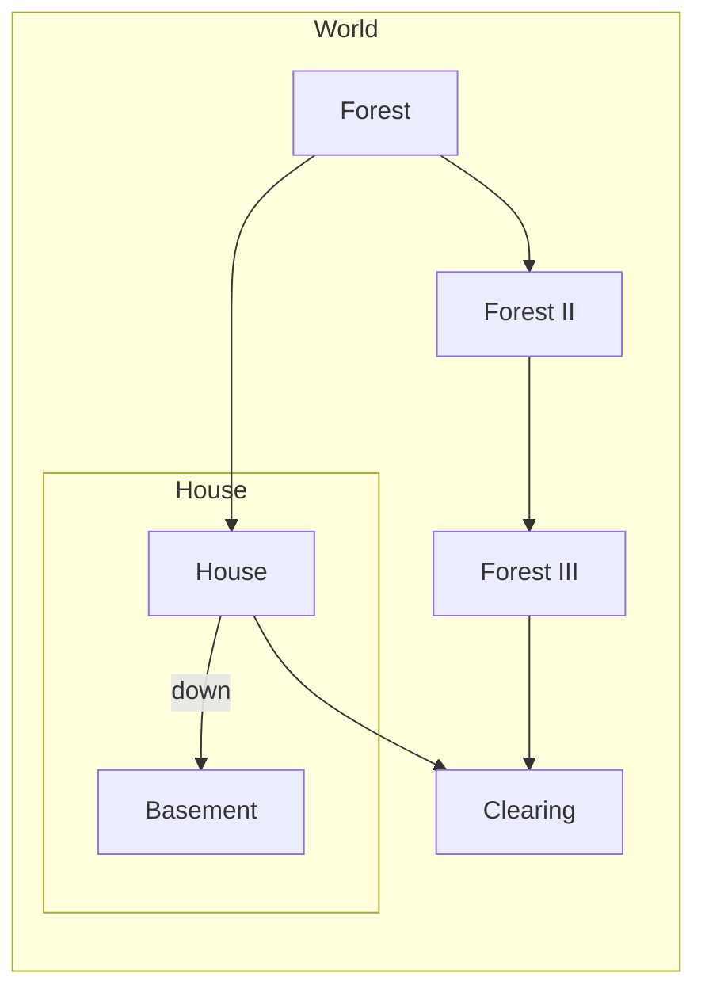

# Zork Game

_**Zork**_ is one of the earliest [interactive fiction](https://en.wikipedia.org/wiki/Interactive_fiction "Interactive fiction") [computer games](https://en.wikipedia.org/wiki/Computer_game "Computer game"), with roots drawn from the original genre game _[Colossal Cave Adventure](https://en.wikipedia.org/wiki/Colossal_Cave_Adventure "Colossal Cave Adventure")_. The first version of _Zork_ was written between 1977 and 1979 using the [MDL programming language](https://en.wikipedia.org/wiki/MDL_programming_language "MDL programming language") on a [DEC PDP-10](https://en.wikipedia.org/wiki/PDP-10 "PDP-10") computer. The authors—[Tim Anderson](https://en.wikipedia.org/wiki/Tim_Anderson_(Zork) "Tim Anderson (Zork)"), [Marc Blank](https://en.wikipedia.org/wiki/Marc_Blank "Marc Blank"), [Bruce Daniels](https://en.wikipedia.org/wiki/Bruce_Daniels "Bruce Daniels"), and [Dave Lebling](https://en.wikipedia.org/wiki/Dave_Lebling "Dave Lebling")—were members of the [MIT](https://en.wikipedia.org/wiki/Massachusetts_Institute_of_Technology "Massachusetts Institute of Technology") Dynamic Modelling Group, see more [here](https://en.wikipedia.org/wiki/Zork).
# Zork by Marco Rodriguez

[Here](https://github.com/marcorod94/VideoGames/tree/master/CLI/Zork) you can find the code for a clone of the Zork game made by [Marco Rodriguez](https://www.linkedin.com/in/marco-rodriguez-b1b21515a/) a Software engineer from Ecuador.

## Instructions

This is a command line game here are the instructions:

- **One Word Commands:** 
	-  **north** or **n:** to go north.
	-  **south** or **s:** to go south.
	-   **east** or **e:** to go east.
	-   **west** or **w:** to go west.
	-   **up** or **u:** to go up.
	-   **down** or **d:** to go down.
	- **look** or **l:** to get basic info of the room.
	-  **stats** or **st:** to get the player stats.
	-  **inventory** or **i:** to get the player inventory.
- **Two Word Commands:** 
	-  **look** or **l (entity):** to get basic info of the entity.
	-  **go (direction):** to go to that direction.
	-   **take** or **pick (item):** to take an item.
	-   **drop** or **put (item):** to drop an item.
	-   **equip** or **eq (item):** to equip an item.
	-   **unequip** or **uneq (item):** to unequip an item.
	- **examine** or **ex (creature):** to get more info of a creature.
	-  **attack** or **at (creature):** to attack a creature.
	-  **loot** or **loot (creature):** to loot a dead creature.
- **Four Word Commands:** 
	-  **unlock** or **unlk (exit) with (item):** to unlock an exit with an item.
	-   **lock** or **lk (exit) with (item):** to lock an exit with an item.
	-    **take** or **pick (item) in (item):** to take an item that is inside other.
	-   **drop** or **put (item) on (item):** to put an item inside other.

Here is the map of this particular game:

## License

You can find the license for this project [here](https://github.com/marcorod94/VideoGames/blob/master/CLI/Zork/LICENSE)